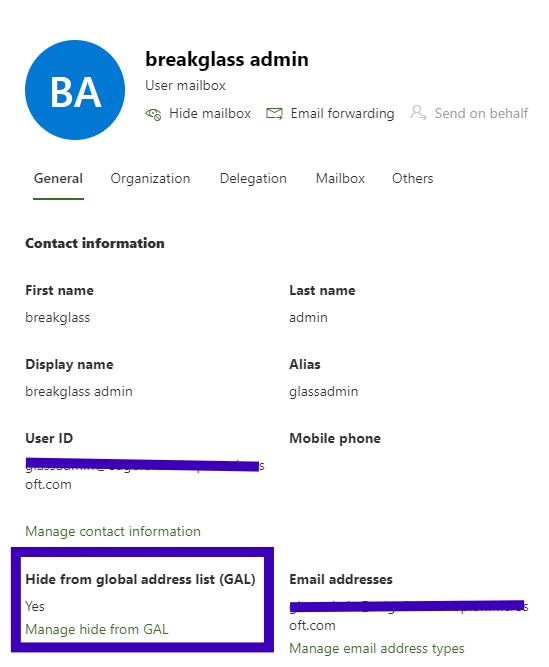

# M365-HoneyTenant-Config-Guide

Jump to: [Getting Started](https://github.com/syne0/M365-HoneyTenant-Config-Guide?tab=readme-ov-file#getting-started) | [Essential Settings](https://github.com/syne0/M365-HoneyTenant-Config-Guide?tab=readme-ov-file#essential-settings) | [Optional Settings](https://github.com/syne0/M365-HoneyTenant-Config-Guide?tab=readme-ov-file#optional-settings) | [Other Considerations](https://github.com/syne0/M365-HoneyTenant-Config-Guide?tab=readme-ov-file#other-considerations)
## Purpose
The purpose of this guide is to detail some recommendations and best practice for configurations when setting up a Microsoft 365 tenant as a honeypot. This is different from the concept of a honeytoken or other early-warning type setup within your primary tenant. The HoneyTenant is intended to be used for a deeper study of threat actor behavior, primarily for threat actor activity post-phish or other credential leak.

With that in mind, this guide details some ways to set up and configure the tenant, the settings required to lock the tenant down as secure as possible, and also provides some examples where settings may need to be adjusted to let the honeypot function, and how you can still keep things relatively secure.

## Disclaimer
Don’t screw up. Don’t play around if you don’t know what you're doing and aren’t prepared for the consequences. Do not tie your honeypot tenant to your dev or prod tenant. Don’t put in similar domains, send emails between them, etc. 

Usage of this guide means that you accept the terms of the [associated licence](LICENSE.md).

## Definitions
HoneyTenant: A Microsoft365 tenant created for the sole purpose of researching malicious behavior.

HoneyUser: A Microsoft365 user account created which you will give a malicious actor access to for research purposes.

## Contributions & Feedback
Contributions and feedback are welcome & appreciated! You can contribute via PRs, Issues, or Discussions. Feedback is welcome via Discussions or Issues as well.

## Getting Started
### Planning
You'll need a few things to make your honeytenant work that require some thought:

- The name of a fake company or organization.
- A domain name that matches that company.
- Names and pictures of a handful of employees. (just search up a random name generator, and use [this](https://thispersondoesnotexist.com/) site to generate the pictures. This is assuming you aren't going to use the sandbox data available with a dev tenant, as mentioned below.)
- Optional: Create a fake website for your fake company, for extra realism.

Once you have your company, domain, and users, you are ready to create your tenant.

### Provisioning Tenant
There are many ways you can obtain a tenant, it doesn't matter what you choose at the end of the day. If you can access the [Microsoft 365 developer program](https://learn.microsoft.com/en-us/office/developer-program/microsoft-365-developer-program-get-started) do that, otherwise, budget for a licence that contains Entra ID Premium P1 as a feature, at the very least. Obviously using E5 licencing is preferred for ease of securing and having maximum features available, but work with what you have.

Your administrative account should have a licence, so should any of the accounts you will be allowing threat actors to access.

Bare minimum licencing I would suggest for the HoneyAccount would be business basic. Your administrative account should also be mail-enabled, and have the ability to access documents. For the admin account I suggest Business Basic + Entra ID Premium Plan 1 at the very least. Having a P1 licence level on the tenant is highly recommend. Of course, use E5 licencing if you can manage it, so you have as many features available as possible.

### Creating Accounts
If you create a tenant via Microsoft's developer platform, you'll have the option to load some sample user accounts via [instant or configurable sandbox](https://learn.microsoft.com/en-us/office/developer-program/microsoft-365-developer-program-get-started#instant-sandbox). Choose the sandbox option that works best for you.

If you are not using the developer tenant, or don't want to use the sandbox, you'll need to create the users and groups manually. This is when you'd use the names you came up with earlier. You can create the users in a variety of ways, just choose whatever way you are the most familiar with.

I personally save the usernames and passwords in a spreadsheet. I know, sue me. I then use that spreadsheet to track what phishing URLs (and other information if I can, such as the kit) are involved with each HoneyUser. 

### Set up domain
You'll need to load the domain you purchased into your tenant, then set your administrator account and any user accounts you created to use that domain as it's primary. Make sure you have enabled privacy on your domain whois as well.

## Essential Settings
### Security Defaults and MFA
I suggest that you disable [Security Defaults](https://learn.microsoft.com/en-us/entra/fundamentals/security-defaults) which will be on by default in new tenants. Make sure you enforce MFA for your administrative account via either [Conditional Access Policies](https://learn.microsoft.com/en-us/entra/identity/conditional-access/howto-conditional-access-policy-admin-mfa) or [Per-User MFA settings](https://learn.microsoft.com/en-us/entra/fundamentals/security-defaults). I personally leave MFA disabled for my HoneyUsers, but it's reasonable to enforce MFA for a subset of users if you want to test the capabilities of various types of phishing kits and MFA bypass methods. Just be careful with adding phone numbers and email addresses to the HoneyUser accounts

### Auditing and Oversight
Ensure you [enable auditing](https://learn.microsoft.com/en-us/purview/audit-log-enable-disable?tabs=microsoft-purview-portal#turn-on-auditing) via the Unified Audit Log.

Grant your administrative account delegated access to any accounts created. This just lets you access the mailbox and poke around.

Place a [litigation hold](https://learn.microsoft.com/en-us/purview/ediscovery-create-a-litigation-hold) on HoneyUser accounts, if you have the right licencing. This just ensures that you don't lose any interesting emails that might have been purged, but can recover them easier than going through eDiscovery.

### Spam Control
If you are using a developer tenant (and just in general), **it's very important that you prevent phishing and spam from being sent outbound.** Allowing your HoneyTenant to be used to send phishing is an easy way to get Microsoft to shut it down.

To accomplish this, I create a few [mail flow/transport rules](https://learn.microsoft.com/en-us/exchange/security-and-compliance/mail-flow-rules/manage-mail-flow-rules).

#### Block Outbound
This will prevent spam and phishing from being sent out, and is the most important rule you will create. I still allow email to be sent intra-org since I consider it not a risk, but you can also apply the rule is the sender is internal, instead of the recipient being external.

Then, depending on how you want to manage things, I suggest setting your rule to do one of the following 3 things.

For the second setting, you can also redirect the message to a specific mailbox, similar to how I forward the message for approval to my admin account. I prefer to use the top setting, since it's easy for me release emails on an individual basis if I want to. 

If you want to allow outbound email (spam, phishing, fraud attempts etc) then be very careful and watch the activity closely. I suggest using the [Outbound Anti-spam Settings to set a message sending limit](https://learn.microsoft.com/en-us/defender-office-365/outbound-spam-policies-configure#use-the-microsoft-defender-portal-to-create-outbound-spam-policies) to something quite low (such as 10 emails), and configure it to block the sender once that limit is reached.

#### Restrict Inbound
When I first created my HoneyTenant, I only created the rule to block outbound mail, as well as a rule to BCC all inbound and outbound email with a blackhole-type mailbox. That worked well for a few weeks, but then threat actors started to use the HoneyUsers to test the deliverability of their phishing emails though M365 spam filters. Oops.

So, that's a risk. There has also been a few times when the HoneyUser has been used to create an account with an external service or website, which the threat actor then uses for a malicious purpose. This activity is definitely useful and fascinating, but I want to ensure it only happens when I have the time to monitor the tenant closely. If I'm not going to be around for a weekend, I'll enable this rule to avoid any of the prior-mentioned shenanigans. 

Same as with the outbound rule, the exact actions you take depend on personal preference. This is what I have it set to do in my tenant.

Toggle this rule as you need, but I suggest not leaving your phished accounts to have unrestricted inbound mail flow if you aren't around to pull the plug on any malicious activity.

## Optional Settings
It's important when you're setting up your HoneyTenant to have some idea of the following:
1) The types of activity you're looking to research. For example, think about the Mitre tactics (initial access, lateral movement, collection, etc) when determining what activity to allow or block.
2) What level of risk you're willing to accept when it comes to having your HoneyTenant and Users act maliciously.
3) How often you intend to check on your HoneyTenant.
4) How hands-on you're going to be.

Those considerations and more will help you determine what activity to block, settings to enable/disable, etc.

For example, I allow quite a lot of activity to occur when I have active accounts, but I only have active accounts when I know I can check on their activity at least twice a day, including checking sign-in logs, the UAL, etc. When the activity has slowed down or I wont be able to monitor them closely, I'll change the password for the accounts to lock them out.

Below is a list of settings that you may chose to enable or disable, and the rationale behind the choices. Settings are grouped by admin centre.

### Exchange Admin Center
#### Hide Accounts from Global Address List
Impacts lateral movement attempts, minimizes inbound spam/phishing you will receive. Can help protect your administrative account from being discovered. At the very least I suggest hiding your admin account, and any service accounts (such as a black hole mailbox) from the GAL.

This would need to be done for every account in the tenant, including when a new account is created.

#### Periodically Purge Global Contacts
So... somehow (probably because I was using my HoneyTenant as a Dev tenant as well. Oops.) My work email got added as a global contact in the Exchange admin center. That should not have happened. There is no way to turn this feature off, so I suggest occasionally purging this repository. The list can be found under Exchange admin > Recipients > Contacts.

#### Globally Disable/Enable Forwarding
Allowing forwarding is a low risk, but I personally prefer to leave it disabled. This can be controlled with the [Outbound Anti-Spam Settings](https://learn.microsoft.com/en-us/defender-office-365/outbound-spam-policies-external-email-forwarding), and should be disabled by default in new tenants.

### SharePoint Admin Center
#### Sharing Settings
You can consider editing the sharing settings for SharePoint and OneDrive. There is a variety of settings that you can adjust, based on what you want to allow. 

The transport rule to block outbound email will prevent sharing from occurring via the SP/OD sharing dialog. If you do not restrict sharing altogether, then it is possible for the threat actor to copy the sharing link and send it via an email address outside the tenant. I have never personally seen this happen, but it's still a risk.

### Admin Center
#### Guest Users
This is similar to the Contacts in Exchange admin. Accounts can end up as a guest user via a variety of activity, and guest users are viewable by everyone. I suggest purging this frequently, especially if you've allowed an account to share something externally.

#### Disable Microsoft's Communications to Users and Viva Insights.
I choose to disable these so that no unnecessary garbage ends up in the mailboxes. The settings are under Settings > Org settings.

#### Forms Restrictions
Phishing can occur via Microsoft Forms, though the activity is rare. Disable Forms sharing or adjust settings via Org settings.

#### Disable Microsoft Teams
Further options for Teams settings are below, but if you don't want to deal with having to secure Teams, you can disable users ability to access Teams altogether via Org settings.

#### Restrict Self-Service Trials and Purchases.
You can consider restricting user ability to start trials or make purchases altogether. Trial usage is interesting, but unpredictable and tricky to audit. This can be done via the [Admin Center](https://learn.microsoft.com/en-us/microsoft-365/commerce/subscriptions/manage-self-service-purchases-admins?view=o365-worldwide) or [PowerShell](https://learn.microsoft.com/en-us/microsoft-365/commerce/subscriptions/allowselfservicepurchase-powershell?view=o365-worldwide), and can be done on a global level or by restricting individual licences.

#### Be Careful with Organization Information
Under Settings > Org settings > Organization profile, you can see the option for Organization information. I believe that this information is able to be viewed by all users in a tenant, and there is no way to prevent this. If you are using a Dev tenant you can likely put whatever you want here. If not, you may need to put some real info down, depending on how you're doing billing. I currently use a fake address and a brand new email address.

### Teams Admin Center
If you don't disable Teams altogether, then I suggest the following settings to restrict it.
#### External Communication
Disallow your users from contacting external domains, as well as communicating with users who are not in an organization. Details on the settings can be found [here](https://learn.microsoft.com/en-us/microsoftteams/trusted-organizations-external-meetings-chat?WT.mc_id=TeamsAdminCenterCSH&tabs=organization-settings#allow-or-block-domains).

### Entra Admin Center
#### Disable Self-Service Password Reset
If you keep MFA disabled for all your accounts I suggest you also disable SSPR. If you leave SSPR enabled, then you need to register security information if you don't want the threat actors do it for you. If you want to have MFA set up then I suggest you [migrate the authentication methods](https://learn.microsoft.com/en-us/entra/identity/authentication/how-to-authentication-methods-manage) so you can granularly control the methods used. These features generally require P1+ licence level to do anything interesting.

#### User Settings
Under Users > User settings there are some interesting settings that you can adjust. I personally have the settings the following way:
- Users can register applications: Yes
- Restrict non-admin users from creating tenants: Yes
- Users can create security groups: No
- Restrict access to Microsoft Entra admin center: No (This is risky, allowing access to Entra admin may lead to them finding information you'd rather they don't.)
- Allow users to connect their work or school account with LinkedIn: No

#### Application Consent Restrictions
I personally don't do this since I like seeing what threat actors do with OAuth applications, but you may consider [restricting OAuth application usage](https://learn.microsoft.com/en-us/entra/identity/enterprise-apps/configure-user-consent?pivots=portal) or consent in various ways.

#### Restrict Access to Azure and Other Sensitive Resources
I suggest restricting access to Azure, and perhaps Graph PowerShell, as there is a good amount of shenanigans they can get up to. You'll need to do this via Conditional Access Policies or other methods, such as the ones [detailed here for Graph PowerShell](https://o365reports.com/2024/04/16/restrict-user-access-to-azure-ad-powershell-and-ms-graph-explorer/) and [here for blocking various Azure resources](https://ashishmgupta.github.io/blog/site/O365SecurityImplementation/site/BlockMiscAzureServices/).

## Other Considerations
### How to Get a Bite
Now that you have a HoneyTenant all set up, you need to bait the accounts and get a threat actor onto your HoneyUser account(s). I've done this a few ways, and you can choose to do it how you please.
1) Obtain phishing emails from Quarantine or another internal source.
2) Locate phishing sites via [Phishing Catcher](https://phish.report/blog/phishing-catcher) or other projects. 
3) Use urlscan.io to threat hunt for phishing pages, [as detailed in this post](https://phish.report/blog/urlscanio-threat-hunting). 
4) In a VM, save the credentials in Chrome or Edge stored passwords, and then execute infostealing malware in the VM.
5) Sell the credentials on initial access broker sites.

## Enhancing Realism
This is the biggest challenge I've had with my HoneyTenant. The more realistic your HoneyTenant, the more realistic the activity you see is going to be. But, realism in the HoneyTenant isn't easy. Using a prefilled Dev tenant will create you some groups and such, but it's obvious to anyone that pokes around that the tenant is basically empty. If you want to improve realism, you'll need to plan it out and make it a bit of a project. 

I am working on a project for improving HoneyTenant realism, but I wont share the details quite yet...
